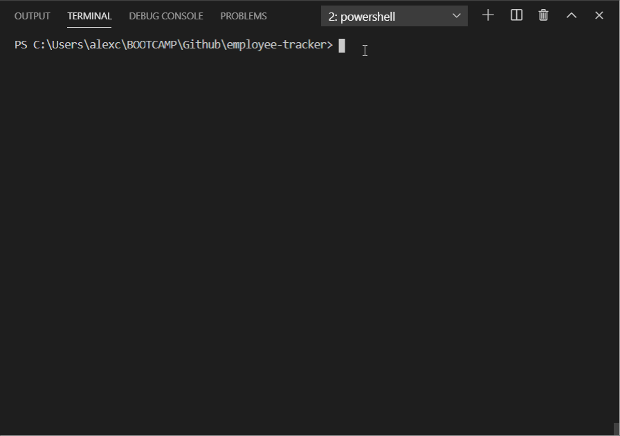

# employee-tracker

 &nbsp;&nbsp;&nbsp; 	  &nbsp;&nbsp;&nbsp; 	  &nbsp;&nbsp;&nbsp; 	  
## Table of Contents  

* [Description](#Description)
* [Installation](#Installation)
* [Usage](#Usage)
* [Built With](#Built-With)

## Description  

  *  A solution for managing a company's employees using node, inquirer, and MySQL.  This application implements an employee database using mysql where a company's information is stored and updated.  The user is asked questions on the command line and has options to  modify information related to employees, roles, and departments in their company.
 
## Installation  

   * Clone this repository from Github from the command line by typing:  
   `git clone https://github.com/alexcoulter/employee-tracker.git`
  * Navigate to the 'note-taker' folder by typing:  
  `cd employee-tracker` 
  * Install dependencies by typing:  
   `npm install`
  * Run this application by typing:   
  `node index` 
 
## Usage  

  *  scroll through the list of options on the command line using the 'up' and 'down' arrow keys and select what you want to do. Answer any questions asked and press 'enter' to update the employee database.  If a red error message pops up, try typing your answer again using the selected criteria.  When you are done, navigate to the option that says 'Exit' and press 'enter' to close the application and the database connection.

  * Usage demo:

>

 
## Built With  

* Node.js
* Inquirer - npm package for asking questions on the command line
* Chalk - module for changing text-color in the command line
* Mysql - Open Source Database Management System
* Console.table - formats table output from mysql call
